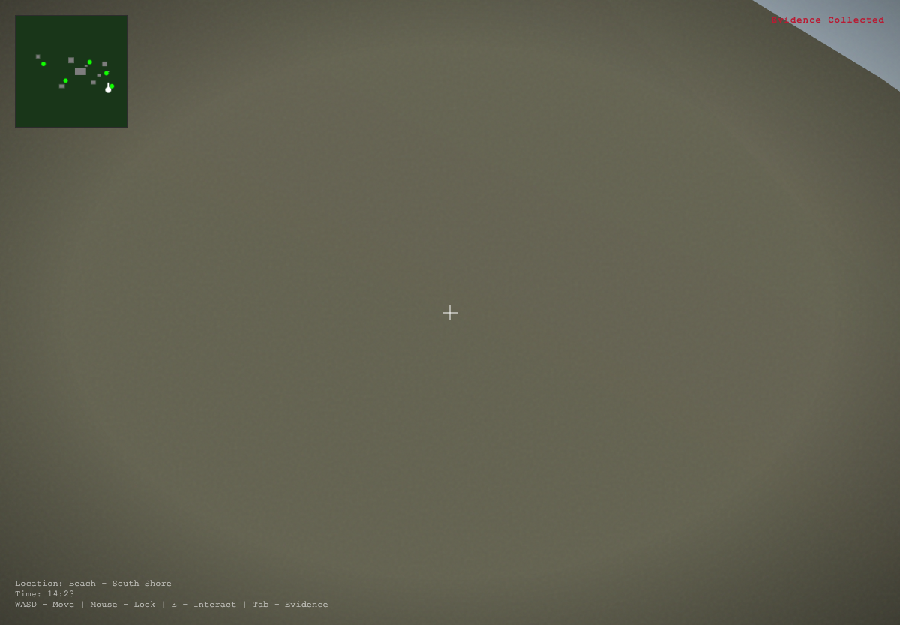

# The Island - An Interactive Investigation

A sophisticated 3D explorable environment of Little St. James island built with Three.js. Walk through one of the most notorious locations in modern history and uncover the evidence hidden within.



## 🎮 Controls

### Desktop
| Key | Action |
|-----|--------|
| **W/A/S/D** or **Arrow Keys** | Move |
| **Mouse** | Look around |
| **E** | Interact with NPCs/Evidence/Buildings |
| **SPACE** | Jump / Advance dialogue |
| **ESC** | Close popups / Pause |
| **TAB** | Toggle evidence inventory |
| **Click** | Lock mouse / Advance dialogue |

### Mobile
- **Left Joystick**: Movement
- **Right Joystick**: Look around (coming soon)
- **E Button**: Interact

## 🚀 Quick Start

### Option 1: Direct Open
Simply open `index.html` in a modern browser. The game loads Three.js from CDN.

```bash
# On macOS
open index.html

# On Linux
xdg-open index.html

# On Windows
start index.html
```

### Option 2: Local Server (Recommended)
For best performance and no CORS issues:

```bash
# Python 3
cd island-3d-explorer
python -m http.server 8080

# Node.js
npx serve .

# PHP
php -S localhost:8080
```

Then visit `http://localhost:8080`

### Option 3: VS Code Live Server
If using VS Code, install the Live Server extension and click "Go Live".

## 🏝️ Features

### Environment
- **Accurate Island Layout**: Based on publicly available aerial photography
- **9 Key Structures**: Temple, mansion, guest villas, helipad, and more
- **Dynamic Day/Night Cycle**: Watch the sun set over the Caribbean
- **Realistic Water**: Animated ocean with reflections
- **Atmospheric Fog**: Adds to the unsettling tone
- **150+ Palm Trees**: Procedurally placed vegetation

### Investigation
- **8 Evidence Items**: Documents and objects to discover
- **5 NPCs**: Characters with multi-part dialogue
- **Location Tracking**: Know where you are on the island
- **Evidence Inventory**: Track what you've collected
- **Minimap**: Navigate the island easily

### Technical
- **First-Person Controls**: Smooth walking exploration
- **Pointer Lock**: Immersive mouse look
- **Mobile Support**: Touch controls for tablets/phones
- **No Build Step**: Pure ES6 modules, just open and play
- **60 FPS Target**: Optimized for smooth performance

## 📁 Project Structure

```
island-3d-explorer/
├── index.html          # Main entry point
├── README.md           # This file
├── src/
│   └── main.js         # Core game logic (Three.js)
├── assets/
│   ├── audio/          # Sound effects & ambiance (future)
│   └── textures/       # Texture files (future)
└── docs/
    ├── MAP_LAYOUT.md   # Detailed island map documentation
    └── NPC_ROSTER.md   # Character profiles and dialogue
```

## 🏗️ Technical Stack

- **Three.js 0.160.0** - 3D rendering engine
- **PointerLockControls** - First-person camera control
- **Water** - Realistic ocean shader
- **Sky** - Dynamic atmospheric scattering
- **ES6 Modules** - Modern JavaScript

## 🗺️ Island Layout

The island recreation includes:

| Location | Position | Description |
|----------|----------|-------------|
| **The Temple** | West ridge | Blue/white striped, gold dome |
| **Main Residence** | Center | Primary mansion complex |
| **Guest Villa A** | East | Large guest house |
| **Guest Villa B** | East | Secondary guest building |
| **Staff Quarters** | North | Personnel housing |
| **Sundial Plaza** | Central-south | Decorative compass structure |
| **Helipad** | East edge | VIP arrival point |
| **Pool House** | Central | Recreation facilities |
| **Security Station** | East perimeter | Monitoring hub |

See `docs/MAP_LAYOUT.md` for detailed coordinates and investigation routes.

## 👥 Characters

Five NPCs provide testimony and hints:

1. **Former Groundskeeper** - Worked the island for years
2. **Investigative Journalist** - Tracking flight logs
3. **Anonymous Witness** - Survivor testimony
4. **Ex-Security Personnel** - Paid for silence
5. **Former Dock Worker** - Saw the arrivals

See `docs/NPC_ROSTER.md` for full dialogue scripts.

## 📄 Evidence Items

Collect 8 pieces of evidence scattered across the island:

- Flight Log Fragment
- Security Protocol
- Temple Keycard
- Partial Guest Registry
- Construction Order
- Torn Photograph
- Medical Supply Invoice
- Staff Member's Diary

Each reveals a piece of the larger picture.

## 🎨 Art Direction

The game uses a **hybrid aesthetic**:
- Low-poly geometry for fast development
- Stylized buildings with clean colors
- Atmospheric lighting and fog
- Film grain overlay for unease
- Vignette effect for focus

This approach creates an unsettling, documentary-like feel while remaining performant and quick to build.

## 🔮 Future Enhancements

Potential additions:
- [ ] Ambient audio (waves, wind, distant voices)
- [ ] Interior exploration of buildings
- [ ] More NPCs with branching dialogue
- [ ] Evidence linking system
- [ ] Photo mode for documentation
- [ ] VR support
- [ ] Additional islands (Great St. James)

## ⚠️ Content Warning

This experience deals with serious subject matter related to real events. It's designed for educational and documentary purposes, based entirely on publicly available information.

## 📝 License

MIT License - Educational/Documentary Use

## 🙏 Credits

- **Three.js Team** - Amazing 3D library
- **Investigative Journalists** - Who uncovered the truth
- **Survivors** - Whose courage made this known

---

*"The only thing necessary for the triumph of evil is for good men to do nothing."*
